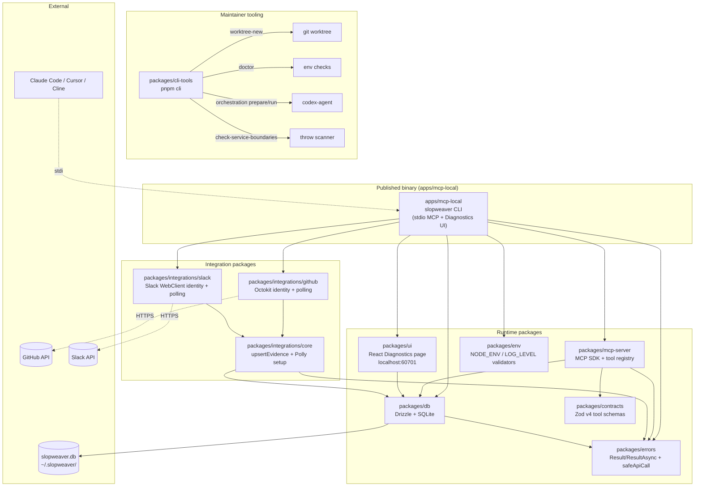
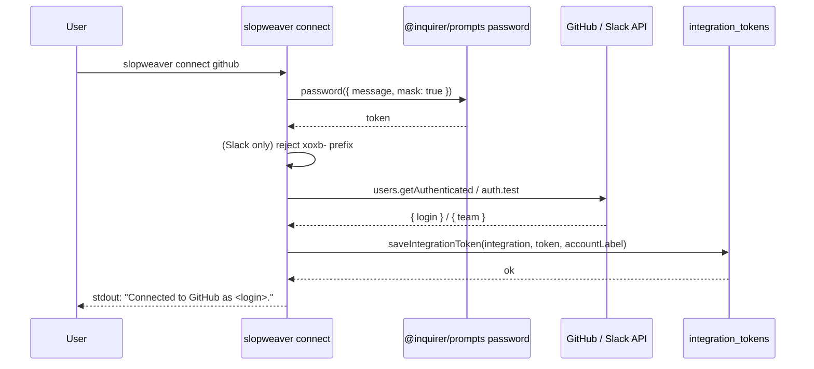
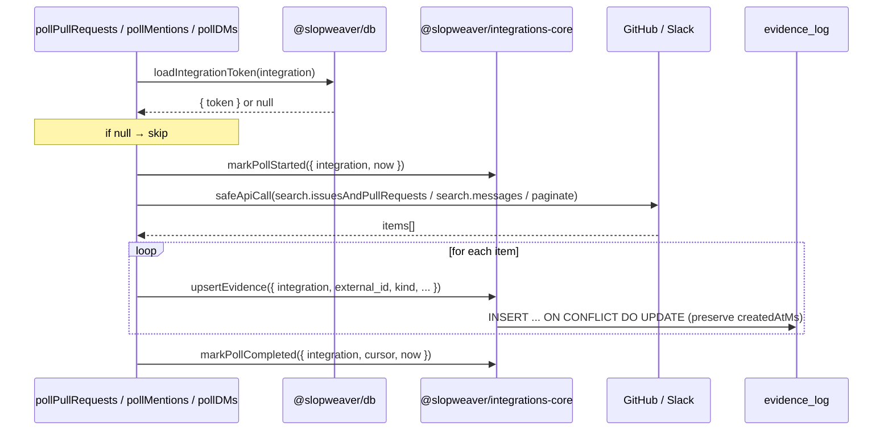
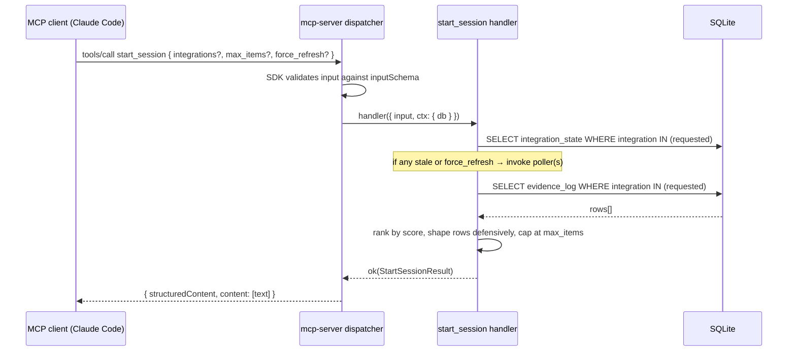
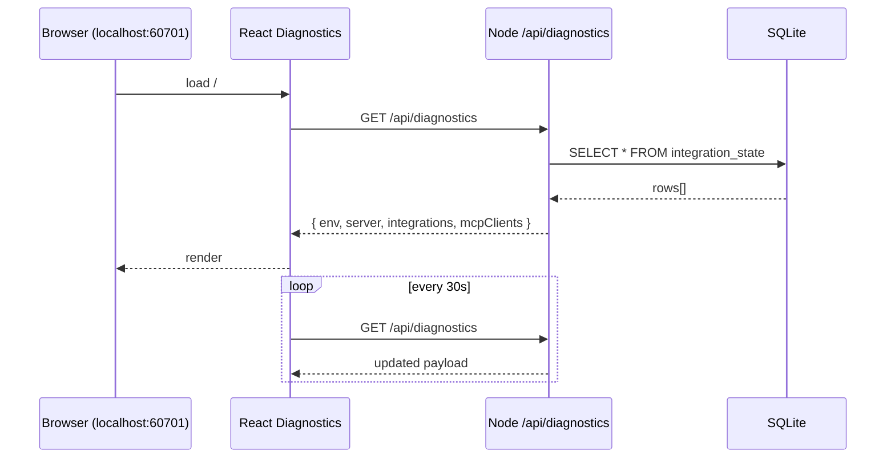

# Codebase Map

> Auto-generated by Cartographer. Last mapped: 2026-05-16T19:33:09Z
>
> SlopWeaver is an open-source local-first MCP server (pre-alpha, v1.0.0 in development) that helps Claude Code answer "what should I work on next?" by searching across your work tools. This map covers the structure, conventions, and key behaviors of the public repo.

## System Overview

A Turborepo monorepo with one published binary app, eight workspace packages, and a maintainer CLI. The published app `apps/mcp-local/` (`npm install -g slopweaver`) is now in place, wiring together the runtime packages.



## Top-level Layout

```
slopweaver/
├── apps/
│   └── mcp-local/                  # The published `slopweaver` binary (Node 22+, stdio MCP + Diagnostics UI)
├── packages/
│   ├── cli-tools/                  # Maintainer CLI (`pnpm cli`)
│   ├── contracts/                  # Zod v4 schemas for MCP tool wire I/O
│   ├── db/                         # Drizzle + better-sqlite3; XDG path resolution; migrations
│   ├── env/                        # Env var validation (NODE_ENV, LOG_LEVEL, etc.)
│   ├── errors/                     # neverthrow re-exports + safeApiCall + BaseError shapes
│   ├── integrations/
│   │   ├── core/                   # Shared upsertEvidence/integration_state + Polly setup
│   │   ├── github/                 # Octokit-based identity + polling
│   │   └── slack/                  # @slack/web-api identity + polling
│   ├── mcp-server/                 # Framework-agnostic MCP server, tool registry, dispatcher, stdio transport
│   └── ui/                         # React Diagnostics page + Node HTTP server (port 60701)
├── docs/                           # Public-facing docs including this map
├── patches/                        # pnpm patches (e.g. @pollyjs/adapter-node-http)
├── .claude/                        # Agent rules, commands, agents, orchestration
├── .github/                        # Issue/PR templates, workflows
└── (configs)                       # biome.json, eslint.config.js, knip.json, turbo.json, tsconfig.base.json, lefthook.yml, .gitleaks.toml
```

## Stack

- **Node 22.12+**, **pnpm 10**, **Turborepo**.
- **TypeScript 6** strict; named object params for any function with 1+ args; no `any` in production code.
- **Biome** for format + lint; **ESLint** for boundary rules (`eslint-plugin-boundaries`, `no-restricted-imports`).
- **Vitest** for tests; **Polly** for HTTP recording in integration tests; **gitleaks** v8.30.1 pre-commit + CI.
- **Drizzle ORM 0.45** + **better-sqlite3** for the local binary's DB.
- **@modelcontextprotocol/sdk 1.29** for the MCP server.
- **Zod 4.4** for tool wire schemas.
- **neverthrow** for `Result`/`ResultAsync` (re-exported only via `@slopweaver/errors`).
- **React 19** + **Vite 8** for the UI bundle.

---

## Module Guide

### `apps/mcp-local` — the published `slopweaver` binary

**Purpose**: The local CLI users install with `npm install -g slopweaver`. Runs an MCP server over stdio and, by default, also serves the Diagnostics UI on `localhost:60701`.

**Entry point**: `src/cli.ts` → `bin: { slopweaver }` → `dist/cli.js`.

**Subcommand tree**:

| Command | Flags | Description |
|---|---|---|
| `slopweaver` (default) | `--no-web-ui` | Run MCP server over stdio; optionally start Diagnostics UI |
| `slopweaver connect <integration>` | none | Prompt for token, validate, persist. `integration` ∈ `{'github', 'slack'}` |
| `--help`, `--version` |  | cac auto-generated (`--version` reads from `package.json`) |

**Key files**:

| File | Purpose |
|---|---|
| `src/cli.ts` | cac entry; registers commands; `runMcpServer` and dispatch for `connect` |
| `src/connect/github.ts` | `runConnectGithub({ db, promptForToken, validateToken, stdout, stderr })`; calls `users.getAuthenticated` → `saveIntegrationToken('github', token, login)` |
| `src/connect/slack.ts` | `runConnectSlack(...)`; rejects `xoxb-` upfront; calls `auth.test` → `saveIntegrationToken('slack', token, team)` |
| `src/cli.smoke.test.ts` | Spawns the compiled `dist/cli.js`, drives MCP wire protocol via `StdioClientTransport`, asserts ping/start_session round-trip and `--no-web-ui` flag |

**`runMcpServer` flow**:
1. `loadEnv()` (from `@slopweaver/env`) — validates `NODE_ENV`, `LOG_LEVEL`; throws on invalid.
2. `resolveDbPath()` / `resolveDataDir()`.
3. `createDb({ path })` — opens SQLite, runs migrations.
4. `createMcpServer({ db, version, tools: [createPingTool(...), createStartSessionTool()] })` — v1 has no pollers wired into `start_session` yet.
5. If UI enabled: `startUiServer({ db, dataDir, port })` (resolved from `SLOPWEAVER_WEB_UI_PORT`, default 60701). `EADDRINUSE` is non-fatal.
6. Registers `SIGINT`/`SIGTERM` → close server → close UI → close DB.
7. `startStdio({ server })`.

**`connect <integration>` flow**: prompt (masked via `@inquirer/prompts` `password`) → validate token against API → `saveIntegrationToken` upsert → stdout confirmation. Slack rejects `xoxb-` tokens before the network call (because `search.messages` requires `xoxp-`). Connect does NOT write to `identity_graph` — that is done by the polling layer.

---

### `packages/mcp-server`

**Purpose**: Framework-agnostic MCP server library. Owns the tool registry, the dispatcher (Result → MCP wire response), builtin tools, the composite `start_session` tool, and the stdio transport.

**Entry point / barrel**: `src/index.ts`.

**Key files**:

| File | Purpose |
|---|---|
| `src/server.ts` | `createMcpServer({ db, tools, version })` — wraps MCP SDK `McpServer`, registers each tool with a dispatcher closure that catches thrown exceptions (→ `McpErrors.unexpected`) and converts `Err` results to `{ isError: true, structuredContent: { code, message } }`. `cause` is stripped at the boundary. |
| `src/errors.ts` | `McpToolUnexpectedError` (extends `BaseError`); single-variant union in v1, designed to grow as composite tools surface named failures. |
| `src/tools/registry.ts` | `defineTool` + `Tool` type-erasure pair; constrains `inputSchema`/`outputSchema` to `z.ZodObject` (non-object Zod types break `tools/list`). |
| `src/tools/builtin/ping.ts` | `createPingTool({ version, startedAtMs, now? })` — returns `PingResult { ok, version, uptime_s }`. Stateless; always returns `Ok`. |
| `src/tools/composite/start-session.ts` | The v1 flagship composite tool. See below. |
| `src/transports/stdio.ts` | `startStdio({ server })` — wraps `StdioServerTransport`. Server lifecycle (signal handling, exit codes) is intentionally left to the app layer. |

**`start_session` composite tool**:

- Reads `evidence_log` for requested integrations and ranks results so Claude can ask "what should I work on next?".
- Ranking: `score = recencyScore + kindBoost` where `recencyScore = 1 / (1 + ageHours / 24)` (~1-day half-life) and `kindBoost = 0.5` for `{mention, review_request, dm}`. Tie-break: `score desc → occurredAtMs desc → id asc`.
- Staleness threshold: 10 minutes (`DEFAULT_STALE_THRESHOLD_MS`). Polls when `force_refresh: true`, no completed poll yet, or last completion older than threshold.
- **Per-platform failure handling**: v1 has NO try/catch around individual poller invocations. A throwing poller fails the whole call (the outer dispatcher catches and returns `isError: true`). Per-platform isolation is a planned improvement.
- `pollers` are factory-injected closures (NOT in `ToolHandlerContext`) — auth tokens are captured at host-app startup.
- `mcp-local` currently calls `createStartSessionTool()` with **no pollers**, so v1 serves cached evidence without polling.
- Defensive row shaping: rows missing `title` AND `kind` are skipped; malformed `citation_url` downgrades to a `canonical` ref; unparseable `payload_json` becomes `null`. A single bad row never aborts the call.

**MCP boundary translation**:

```ts
// In server.ts dispatcher closure:
// 1. Thrown exception → McpErrors.unexpected(toolName, cause) → { isError: true, { code, message } }   (cause stripped)
// 2. Err result       → { isError: true, structuredContent: { code, message }, content: [text] }
// 3. Ok result        → { structuredContent: output,            content: [JSON.stringify(output)] }
```

---

### `packages/ui` — React Diagnostics page + Node HTTP server

**Purpose**: Local-only diagnostics UI for the `slopweaver` binary. Two build artifacts: a Vite-built React SPA (`dist/client/`) and a tsc-compiled Node server (`dist/server/`). `apps/mcp-local` imports `startUiServer`.

**Architecture**:
- Production: pure `node:http` server on `127.0.0.1:60701`. Routes `/api/*` to JSON handlers, everything else to static files from `dist/client/` (with SPA fallback for extensionless paths).
- Dev: Vite dev server on port `60702` (one above prod to allow concurrent operation).
- No framework, no router, no state library, no React Query/SWR. The Diagnostics page polls `/api/diagnostics` every 30s via plain `fetch` with `useState` + `useEffect`.

**Key files**:

| File | Purpose |
|---|---|
| `src/server/index.ts` | Barrel — `startUiServer`, `DEFAULT_HOST`, `DEFAULT_PORT`, `DiagnosticsResponse` types. |
| `src/server/start.ts` | The HTTP server. Origin-header validation (rejects cross-origin), path-traversal guard, IPv6-safe URL formatting, `port: 0` test support (port read from `server.address()` after listen). |
| `src/server/diagnostics.ts` | `buildDiagnosticsResponse({ db, staticChecks, bindAddress, nowMs? })` — queries `integration_state`, classifies stale (>10 min old) vs fresh vs never-run. |
| `src/server/checks.ts` | `checkNodeVersion / checkPnpmVersion / checkDataDir` — also used by `runStaticEnvChecks` at server startup. pnpm failure here is downgraded to `warn` (the binary doesn't need pnpm). |
| `src/server/types.ts` | Shared wire types (`DiagnosticsResponse`, `EnvCheck`, `IntegrationStatus`, `STALE_THRESHOLD_MS`). Dependency-free so client can `import type` from it. |
| `src/server/static-dir.ts` | `CLIENT_ASSETS_DIR` — resolved via `import.meta.dirname` (Node 22+). |
| `src/client/main.tsx`, `App.tsx`, `App.css` | React entry; mounts `<Diagnostics />` in `<StrictMode>`. |
| `src/client/api/diagnostics.ts` | `fetchDiagnostics()` — plain fetch; **throws** on non-2xx (per the error-handling carve-out for `packages/ui/src/client/api/**`). |
| `src/client/pages/Diagnostics.tsx` | Sole page. 30s polling with overlapping-request guard and unmount-cancellation flag. Shows Environment, Server, Integrations table, MCP clients (hardcoded count). |
| `vite.config.ts` | Vite config — port `60702`, `dist/client` output, sourcemaps on. |
| `tsconfig.build.json` | Server-only tsc emit; `lib: ['ES2022']` to keep DOM types out of `dist/server/`. |

**Security**: Loopback bind only; Origin allowlist computed per-request from actual bound address (so `port: 0` tests work); path-traversal guard via `path.relative` check.

---

### `packages/db` — Drizzle + SQLite

**Purpose**: SQLite schema, migrations, `safeQuery` wrapper, XDG path resolution, and the `integration_tokens` read/write helpers used by the `connect` flow.

**Entry point / barrel**: `src/index.ts` — exports `createDb`, `SlopweaverDatabase`, `SqliteHandle`, all schemas (re-exported), `safeQuery`, `resolveDataDir`, `resolveDbPath`, `loadIntegrationToken`, `saveIntegrationToken`, `extractSqliteErrorShape`, `DbErrors`.

**Tables (5)**:

| Table | Purpose | Notable constraints |
|---|---|---|
| `workspaces` | Single-row instance descriptor | `CHECK (id = 1)` — single-workspace v1 |
| `integration_tokens` | Plaintext token storage for `connect` | PK on `integration`; `accountLabel` nullable |
| `integration_state` | Per-integration polling bookkeeping | PK on `integration`; `cursor` is opaque per-integration |
| `evidence_log` | Snapshot store for upstream events (PRs, issues, mentions, DMs, …) | UNIQUE `(integration, external_id)` for idempotent upsert; indexes on `(integration, kind)` and `(integration, occurred_at_ms)` |
| `identity_graph` | Maps platform identities → canonical persons | UNIQUE `(integration, external_id)`; index on `canonical_id` |

**Migrations**: Two so far. `0000_overconfident_lionheart.sql` (initial schema), `0001_solid_whirlwind.sql` (adds `integration_tokens`). Run synchronously by `createDb()`. **Never write migrations by hand** — generate with `pnpm drizzle-kit generate` from clean main.

**Key behaviors**:
- `createDb({ path })` opens SQLite (with `:memory:` sentinel for tests), runs migrations, enables `PRAGMA foreign_keys = ON`.
- `resolveDataDir({ home?, xdgDataHome? }): Result<string, DataPathInvalidError>` — returns `$XDG_DATA_HOME/slopweaver` if absolute, else `~/.slopweaver`. **Rejects relative `XDG_DATA_HOME` rather than silently resolving against cwd.**
- `safeQuery({ execute }): ResultAsync<T, DatabaseError>` — the DB-side counterpart to `safeApiCall`. Service code must never wrap Drizzle calls in `try/catch`.
- `loadIntegrationToken` returns `ok(null)` when no row (not an error); `saveIntegrationToken` upserts and preserves `createdAtMs` across re-runs.
- `extractSqliteErrorShape` BFS-walks the `.cause` chain to extract the deepest `SQLITE_*` code; parses `UNIQUE constraint failed: table.column` heuristically.

---

### `packages/errors` — Result/ResultAsync foundation

**Purpose**: The base layer for the repo-wide error pattern (decision record #41).

**Entry point / barrel**: `src/index.ts`.

**Exports**:
- From `neverthrow` (only re-exported via this package; direct imports banned via `eslint.config.js`): `ok`, `err`, `okAsync`, `errAsync`, `Result`, `ResultAsync`, `fromThrowable`.
- `BaseError` interface — `{ readonly code: string; readonly message: string }`. Every domain error in the repo extends this with a literal `code` discriminant in `SCREAMING_SNAKE_CASE`.
- `ApiCallError`, `DatabaseError` — the raw output shapes of `safeApiCall` / `safeQuery`. **Intentionally do NOT extend `BaseError`** because their `code` fields are optional (not every vendor/SQLite error has a structured code).
- `safeApiCall({ execute, provider, extractError? })` — exception-to-Result bridge for all external SDK/API calls. The `extractError` callback's own throws are silently swallowed (to preserve the `ResultAsync` contract).

**Pattern**:
- Each package defines its domain errors in a local `errors.ts` (or `src/lib/errors.ts`) as interfaces extending `BaseError`, plus a factory namespace (`SlackErrors.tokenInvalid(prefix)`, `GithubErrors.apiError(endpoint)`, etc.). Callers go through factories — never construct inline.
- Service code returns `Result<T, E>` / `ResultAsync<T, E>` where `E` is the package's discriminated union. Service files **never throw**; this is enforced by the `check-service-boundaries` scanner.
- Errors are unwrapped only at the user-facing boundary (CLI `if (result.isErr()) { print + exit }`; MCP dispatcher converting `Err` to `isError: true`).

See `.claude/rules/error-handling.md` for the full convention.

---

### `packages/contracts` — Zod tool schemas

**Purpose**: Single file (`src/index.ts`) defining all Zod v4 schemas for the MCP tool wire protocol. Shared between `mcp-server` and clients.

**Key exports**:
- `PingArgs` (empty strict object), `PingResult` (`{ ok, version, uptime_s }`).
- `Reference` (discriminated union of `url` and `canonical` refs), `Freshness`, `EvidenceLogEntry`.
- `StartSessionArgs` (`{ integrations?, max_items? 1–25, force_refresh? }`), `StartSessionResult`.

**Conventions**:
- All schemas use `.strict()` — extra properties rejected.
- Schemas and inferred types share names (`export const PingResult = z.object(...)` and `export type PingResult = z.infer<typeof PingResult>`).
- `IsoDatetimeSchema` requires timezone offset (`z.iso.datetime({ offset: true })`).
- `JsonValueSchema` uses `z.lazy` for recursion.

**Note**: `EvidenceLogEntry.id` is non-empty `string` on the wire but the DB column is integer autoincrement. The `mcp-server` layer is responsible for the conversion.

---

### `packages/env`

**Purpose**: One-file validator for environment variables (`NODE_ENV`, `LOG_LEVEL`, etc.). Used by `apps/mcp-local` at startup in both `runMcpServer` and `runConnect` paths.

**Boundary status**: Scanned by `check-service-boundaries` (`packages/env/src/index.ts` is in the explicit-files list); the throw at parse time is a documented carve-out (the CLI catches and prints cleanly via the `asMessage()` helper).

---

### `packages/integrations/core`

**Purpose**: Shared write helpers for every integration package. Also owns the cassette/Polly test setup that all integration test suites import from.

**Exports**:
- Runtime barrel (`src/index.ts`): `upsertEvidence`, `markPollStarted`, `markPollCompleted`, `readCursor`.
- Test-setup subpath (`./test-setup/polly`, `src/test-setup/polly.ts`): `definePollySetup({ extraRedactors?, extraRequestRewriter? })` and a deep redactor `redactJsonValue`.

**`upsertEvidence`**: Inserts into `evidence_log` with `ON CONFLICT (integration, external_id) DO UPDATE` that bumps `lastSeenAtMs`/`updatedAtMs` but preserves `firstSeenAtMs`/`createdAtMs`. Uses SQLite-specific `excluded.*` references.

**`markPollStarted` / `markPollCompleted`**: The pair stamps `lastPollStartedAtMs` before the API call and `lastPollCompletedAtMs` + `cursor` after. The divergence between started and completed is the "in-flight poll" diagnostic signal. `markPollCompleted` returns `ok(0)` (not an error) when no `markPollStarted` row exists — a contractual signal callers can check.

**Polly setup**:
- Modes: `replay` (default, missing cassette fails), `record` (live API + write cassette; requires monorepo-root `.env`), `passthrough` (debug only).
- Cassette path: `<test-file-dir>/__recordings__/<suite-name>/<test-name>/recording.har`.
- Matching: method + URL (hostname, pathname, protocol) — body and headers are NOT part of the key.
- `globalThis.fetch` is replaced with `node-fetch` so Polly's `node:http` adapter can intercept; restored in `afterAll`. The override forces `accept-encoding: identity`.
- `beforePersist` decompresses base64-encoded gzip/brotli/deflate bodies (e.g. axios-using SDKs like `@slack/web-api`) and strips `content-encoding` so the patched adapter doesn't double-decompress on replay.
- **Default redactors** strip standard auth headers, all cookies, JSON keys matching `/token|secret|authorization|password|api[-_]?key/i`, and string values matching token shapes (`gh[pousr]_…`, `xox[aboprdes]-…`).
- **`nock.disableNetConnect()`** in replay mode (except loopback) ensures any HTTP call that slips past Polly fails immediately.
- Loads monorepo-root `.env` for record-mode tokens without overriding already-set vars.
- A patched `@pollyjs/adapter-node-http` lives at `patches/@pollyjs__adapter-node-http@6.0.6.patch`.

---

### `packages/integrations/github`

**Purpose**: GitHub identity fetch + three pollers (`pollPullRequests`, `pollIssues`, `pollMentions`) writing to `evidence_log` and `identity_graph`.

**Layered modules**:

| File | Purpose |
|---|---|
| `src/client.ts` | `createGithubClient({ token, userAgent? })` — Octokit factory with `@octokit/plugin-throttling` (MAX_RETRIES=2), pinned `request.fetch: globalThis.fetch` for Polly compatibility. Returns plain `Octokit` (no Result wrap). |
| `src/errors.ts` | `GithubError = GithubApiError \| GithubDatabaseError`. Codes: `GITHUB_API_ERROR`, `GITHUB_DATABASE_ERROR`. `safeGithubCall({ execute, endpoint })` wraps `safeApiCall` and `.mapErr()`s to `GithubApiError`. `fromDatabaseError(dbError)` bridges DB errors into the GitHub union. |
| `src/identity.ts` | `fetchIdentity({ db, token, now? })` calls `users.getAuthenticated` then upserts `identity_graph` with `canonical_id = github:<user_id>` (numeric string). |
| `src/polling.ts` | All three pollers call `search.issuesAndPullRequests` with different qualifiers (`involves:@me is:pr`, `involves:@me is:issue`, `mentions:<username> is:pr`). `external_id` is kind-prefixed (`pr_<id>`, `issue_<id>`, `mention_<id>`). |
| `src/test-setup/polly.ts` | Plugs into `@slopweaver/integrations-core`'s `definePollySetup` with `extraRedactors: [redactGithubUserResponse]` and `extraRequestRewriter: maybeScopeGithubSearchUrl` (appends `repo:<RECORD_REPO_SCOPE>` in record mode). |
| `src/__recordings__/` | Cassettes (.har) — gitignored except for explicit allow-list entries. |

**Gotchas**:
- `pollMentions` requires a `username` param because GitHub's `mentions:` qualifier rejects `@me`.
- v1 `pollMentions` covers PRs only (`is:pr`); issue mentions are a documented follow-up.
- `PER_PAGE = 50`, no pagination loop — only the first page is fetched (sorted `updated desc`).
- Empty-poll cursor preservation: `items[0]?.updated_at ?? since?.toISOString() ?? null`.

---

### `packages/integrations/slack`

**Purpose**: Slack identity fetch + two pollers (`pollDMs`, `pollMentions`) writing to `evidence_log` and `identity_graph`.

**Layered modules**:

| File | Purpose |
|---|---|
| `src/client.ts` | `createSlackClient({ token, retryConfig? }): Result<WebClient, SlackTokenInvalidError>` — synchronous, validates non-empty token, picks prod vs test retry config from `NODE_ENV`. |
| `src/errors.ts` | `SlackError` union of 5 codes: `SLACK_TOKEN_INVALID`, `SLACK_API_ERROR` (carries `slackCode` from the SDK's `WebAPIPlatformError`), `SLACK_DATABASE_ERROR`, `SLACK_PAGINATION_CAP_EXCEEDED`, `SLACK_TS_PARSE_FAILED`. |
| `src/identity.ts` | Two-step: `auth.test` → `users.info`. Upserts `identity_graph` with `canonical_id = slack:<team_id>:<user_id>` (workspace-scoped). |
| `src/dms.ts` | `conversations.list?types=im` → `conversations.history` per channel via `slack.paginate()`. Wrapped in a single `try/catch` because the SDK's async iterator doesn't compose with `safeSlackCall`. Cursor: newest `ts` across all channels, converted to ISO-8601. |
| `src/mentions.ts` | `search.messages` with `<@U…>` query; page-based pagination walked manually with `PER_PAGE = 100`, `MAX_PAGES = 20`. On cap exceeded, returns `Err(SLACK_PAGINATION_CAP_EXCEEDED)` and `markPollCompleted` never runs — cursor is not advanced. Uses `after:YYYY-MM-DD` modifier padded backward by 1 day for timezone-ambiguity hedging. |
| `src/upsert.ts` | Slack-specific shim: translates Slack messages into `upsertEvidence` args. `external_id = <kind>_<ts>:<channelId>`. |
| `src/test/db.ts` | `openMemoryDb()` thin wrapper around `createDb({ path: ':memory:' })`. |
| `src/test/setup-polly.ts` | Plugs into core's `definePollySetup` with `slackRedactors`. |
| `src/test/redact-slack.ts` | Deep-walks Slack JSON; scrubs `text`, profile PII, channel names, `properties` subtree, hostnames; preserves IDs. Has a sentinel-driven test (`redact-slack.test.ts`) that fails CI on unredacted PII. |

**Gotchas**:
- `search.messages` requires a user token (`xoxp-`). Bot tokens (`xoxb-`) return `not_allowed_token_type` — `mcp-local`'s `connect slack` pre-rejects bot tokens before calling the API.
- DMs poller has no pagination cap; very active workspaces could be slow.
- `fetched` count includes messages that were silently skipped during upsert (missing `ts` or `channelId`).

---

### `packages/cli-tools` — the `pnpm cli` maintainer CLI

**Purpose**: One-stop CLI for repo maintenance. Runs via `tsx packages/cli-tools/src/cli.ts`.

**Subcommands**:

| Subcommand | Flags | What it does |
|---|---|---|
| `worktree-new <name>` | `--no-install` | Creates `<repo-parent>/worktrees/<safeName>` on branch `worktree/<safeName>` from `origin/main`, runs `pnpm install` (unless skipped) |
| `check-service-boundaries` |  | Scans configured boundary files for `throw` statements; exit 1 on findings. First gate of `pnpm validate`. |
| `doctor` |  | Checks Node>=22.12, pnpm>=10, port 60701 free, data dir writable, optional codex-agent health |
| `orchestration prepare <chainPath>` | `--executor <hybrid\|codex-only>` | Bootstraps worktree + writes `launcher-manifest.json` for the external Claude-side launcher |
| `orchestration run <chainPath>` | `--dry-run`, `--restart`, `--notify` | Codex-only full pipeline: planning → implementation → PR → review loop → CI loop → manual QA stop |

**Internal layout**:

```
src/
├── cli.ts                              # cac entry
├── check-neverthrow-service-boundaries/
│   ├── core.ts                         # listBoundaryFiles, scanFiles, findThrowSites (pure)
│   └── index.ts                        # runAndExit — CLI runner
├── doctor/
│   ├── checks.ts                       # checkNodeVersion / checkPnpmVersion / checkPortFree / checkDataDir / checkCodexAgent
│   └── index.ts                        # runDoctor — orchestrator with picocolors output
├── lib/
│   ├── colors.ts                       # raw ANSI escapes (used by orchestration)
│   ├── data-dir.ts                     # resolveDataDir — duplicated from @slopweaver/db to avoid sqlite dep
│   ├── errors.ts                       # LibErrors: DataPathInvalidError, MonorepoRootNotFoundError
│   └── paths.ts                        # findMonorepoRoot (walks up looking for pnpm-workspace.yaml), resolveWorktreesRoot
├── orchestration/
│   ├── core.ts                         # Pure parsers/decisions: parseOrchestrationChain, buildImplementationPrompt, buildReviewPrompt, parseCodexJobId, parsePullRequestUrl, isSuccessfulReview, looksLikeTransientModelFailure, getModelCandidates, interpolateTemplate
│   ├── runtime.ts                      # Stateful engine: prepareOrchestration, runOrchestration, RunOrchestrationEnvironment, createDefaultEnvironment
│   ├── errors.ts                       # 12 OrchestrationError codes
│   └── index.ts                        # cac adapter: prepare, run, normalizeExecutor
└── worktree/
    ├── errors.ts                       # WorktreeError union with exitCode field
    ├── plan.ts                         # buildWorktreePlan, sanitiseTaskName
    └── index.ts                        # runWorktreeNew — git fetch + git worktree add + pnpm install
```

**Service-boundary scanner** (`check-neverthrow-service-boundaries/`):
- Scans 7 directories (`packages/db/src`, `packages/cli-tools/src/lib`, `packages/integrations/{core,github,slack}/src`, `packages/mcp-server/src/tools`, `apps/mcp-local/src/connect`) plus 5 explicit files (`packages/cli-tools/src/orchestration/{core,runtime}.ts`, `packages/cli-tools/src/worktree/index.ts`, `packages/env/src/index.ts`, `packages/mcp-server/src/server.ts`).
- Excludes test directories and `.test.ts`/`.smoke.test.ts`/`.cassette.test.ts` suffixes, plus `__recordings__/`, `node_modules`, `dist`.
- Throw regex: `/(?:^|[\s;{])throw\b(?=\s|\()/` — catches both `throw ` and `throw(` while ignoring identifier substrings like `mythrow`.
- Comment guard: only checks line-start markers (`//`, `*`, `/**`). Inline trailing comments after code are not recognized — biome's auto-formatter makes this safe in practice.

**Orchestration module**:
- Persists `RunState` JSON to `$CODEX_HOME/orchestration-runs/<slug>/state.json`; artifacts go in `<runDir>/artifacts/`.
- Phases: `initial → planning → implementation → pr → review → ci → awaiting_manual_qa`. State monotonically advances, never regresses.
- Model fallback: `getModelCandidates({ attempts, kind, repeatedReviewFindings })` returns an ordered list. Planning/review/diagnosis always start with `gpt-5.4 xhigh`. Implementation starts cheap (`gpt-5.3-codex-spark low`) and escalates on retry or repeated findings.
- 12 error codes (full list in `orchestration/errors.ts`): `ORCHESTRATION_MISSING_TITLE`, `_INVALID_JOB_ID_OUTPUT`, `_INVALID_PR_URL_OUTPUT`, `_MISSING_PLAN_PROMPT`, `_WORKTREE_MERGE_CONFLICT`, `_WORKTREE_DIRTY`, `_MODEL_ATTEMPT` (kind: transient|fatal), `_ALL_MODELS_FAILED`, `_REVIEW_NOT_CONVERGED` (max 5), `_CI_NOT_CONVERGED` (max 5), `_CI_RUN_ID_MISSING`, `_SUBPROCESS_FAILED`.
- `RunOrchestrationEnvironment` abstracts all subprocess/git/CI side effects, making the whole state machine unit-testable. The default impl uses `codex-agent start/await-turn/send/quit`, `git`, `gh`, `pnpm cli worktree-new <name>` (recursive!), and optional `cmux notify`.
- `--restart` deletes the entire run directory.
- Hybrid mode: `prepare` writes `launcher-manifest.json` for an external Claude-side launcher; `run` is always codex-only.

---

## Data Flow Diagrams

### `connect <integration>` flow



### Poll loop (per integration)



### `start_session` MCP tool call



### Diagnostics UI polling



---

## Conventions

### TypeScript

- **Named object params** for any function with 1+ params: `function f({ a, b }: { a: string; b: number })`. Exceptions: zero-arg functions, callbacks (`map`, `onClick`), type predicates (TS1230), library/DSL signatures (`eq(table.col, val)`, `describe(name, fn)`).
- **Positional params for type predicates** — TypeScript error TS1230 forbids destructured type-predicate params.
- **No `any`** in production code — use `unknown` + a type guard.
- **Explicit return types on exported functions** — inferred is fine for internal helpers but a maintenance hazard at module boundaries.
- **`satisfies` over type assertions** for complex object literals.
- **Inline object types** for single-use params; extract a `type` alias only when 2+ call sites want it.
- **JSDoc on exported functions** — one or two lines, surface the *why*, leave *what* to identifiers/types.
- **`== null`** is the idiomatic null-or-undefined check.

### Error handling (`@slopweaver/errors` + Result/ResultAsync pattern)

- Service-boundary files (the 7 directories + 5 explicit files scanned by `check-service-boundaries`) **never throw**.
- All fallible functions return `Result<T, E>` / `ResultAsync<T, E>` where `E` is a discriminated union of interfaces extending `BaseError`.
- External SDK/API calls go through `safeApiCall`; DB calls go through `safeQuery`.
- Each package owns its `errors.ts` defining the error union + a factory namespace (`SlackErrors.tokenInvalid(prefix)`).
- Direct `neverthrow` imports are linter-blocked except inside `packages/errors/**`. All other code imports from `@slopweaver/errors`.
- Carve-outs (throws allowed): browser-side data fetchers in `packages/ui/src/client/api/**`, CLI entry points (where Result is unwrapped via `.match()` or `if (isErr)`), and recovery/classification `try/catch` blocks that don't re-throw.

### Imports / boundaries

- Direct imports between packages, no dependency-inversion abstractions until there's a real second implementation.
- Apps wire packages; packages never import from apps (enforced by `eslint-plugin-boundaries`).
- No `@nestjs/*` in `packages/*` — NestJS will belong to the v2 cloud-tier-only `apps/cloud/`.

### Tests

- Co-located `<name>.test.ts` alongside source. No `__tests__/` directories.
- Three logical kinds — pure function (most files), Polly-replay (integration with cassettes), smoke (spawn real binaries). Filename suffix `.smoke.test.ts` / `.cassette.test.ts` only when filtering matters; today every package's `vitest.config.ts` `include`s only `src/**/*.test.ts`.
- Shared per-package test helpers in `src/test/` (`packages/integrations/slack/src/test/db.ts`, `setup-polly.ts`, `redact-slack.ts`). Cassettes in `src/__recordings__/`.
- Assertion preferences: exact value over existence checks; `.toBe(true)` over `.toBeTruthy()`; assert actual values over `typeof x === 'string'`; `expect.any(...)` inside `toEqual()` is fine for dynamic fields.
- Hard rules: no `.skip` on real tests (one searchability-placeholder exception in `packages/integrations/slack/src/mentions.test.ts`); never weaken assertions; never use synthetic stubs in Polly-replay tests; cassettes are never edited by hand.

### PRs

- Conventional-commit titles: `feat(scope): ...`, `fix(scope): ...`, `docs: ...`, etc.
- One worktree = one branch = one PR. Open as `--draft` initially. Squash-merge only. Always merge `origin/main`, never rebase.
- Target ≤500 lines of diff (excluding generated files).
- Before requesting review: `pnpm validate` must pass locally (six gates: check-service-boundaries, format:check, lint, compile, test, knip).

### Worktrees

- Never edit files in the main checkout. `pnpm cli worktree-new <name>` creates `~/dev/worktrees/<name>` on branch `worktree/<name>`.
- After a PR squash-merges: `git worktree remove <path> && git branch -d worktree/<name>`.

---

## Gotchas

- **`pnpm validate` has SIX gates** (not four as some older docs say): `check-service-boundaries` → `format:check` → `lint` → `compile` → `test` → `knip`. CI also runs `gitleaks detect` as a seventh gate.
- **Drizzle migrations are tool-generated only** — run `pnpm drizzle-kit generate` from a clean `main` baseline. Never hand-edit or generate from stale worktree state.
- **`start_session` has no per-platform isolation in v1** — a throwing poller fails the whole tool call. Per-platform try/catch is a planned improvement.
- **`createStartSessionTool()` is called with no pollers in `mcp-local`** — v1 serves cached evidence only; live polling is wired in a follow-up PR.
- **Slack `search.messages` rejects bot tokens** — `mcp-local`'s `connect slack` pre-rejects `xoxb-` prefix before the network call.
- **GitHub's `mentions:` qualifier rejects `@me`** — `pollMentions` requires an explicit `username` arg.
- **GitHub pollers fetch only the first page** (`PER_PAGE = 50`, no pagination loop). The second page is silently dropped.
- **Slack mentions cap at 20 pages** (`MAX_PAGES`); exceeding it returns `Err(SLACK_PAGINATION_CAP_EXCEEDED)` and the cursor is NOT advanced — recoverable on retry.
- **`@pollyjs/adapter-node-http` is patched** at `patches/@pollyjs__adapter-node-http@6.0.6.patch` — required for cassette replay to work with axios-based SDKs (Slack). Don't remove the pnpm patches block.
- **`globalThis.fetch` is replaced with `node-fetch` during tests** — there is a short race window at vitest startup where the native fetch may still be active. If you see a "live API hit during replay" surprise, check the IIFE timing in `packages/integrations/core/src/test-setup/polly.ts`.
- **`node:http` server uses Origin allowlist computed per-request** from the actual bound address — so `port: 0` tests work, and `localhost` aliases are added explicitly.
- **`packages/ui` emits two artifacts** (`dist/client/` Vite SPA + `dist/server/` tsc Node). `tsconfig.build.json` excludes DOM types from the server bundle so it stays Node-clean.
- **`apps/mcp-local`'s smoke test spawns the real `dist/cli.js`** — make sure the build succeeded before running it; failures often manifest as opaque ENOENTs.
- **The orchestration `pnpm cli worktree-new` recursion**: the orchestration runtime shells out to the same CLI binary to create worktrees. Don't introduce circular state in `cli.ts` init.
- **`SLOPWEAVER_WEB_UI_PORT` parses strictly** — `"60701junk"` is rejected. Use `--no-web-ui` to skip the Diagnostics server in headless setups.
- **`identity_graph` is NOT written during `connect`** — only the polling layer writes there. `connect` writes only `integration_tokens`. This matters because `connect` is intended to be re-runnable.
- **The `_team_id` field** is injected into the stored Slack `payload_json` by `upsertSlackMessage` so consumers can resolve workspaces without a separate join.

---

## Navigation Guide

**To add a new MCP tool**:
- Composite tool (touches multiple integrations): create `packages/mcp-server/src/tools/composite/<name>.ts` mirroring `start-session.ts`. Add Zod schemas to `packages/contracts/src/index.ts`. Wire it in `apps/mcp-local/src/cli.ts`'s `tools` array.
- Single-platform tool: create `packages/integrations/<platform>/src/mcp-tools/<name>.ts` (the `mcp-tools/` subdir is the planned home; none exist yet). Wire it the same way.
- Tests: add `<name>.test.ts` co-located. Use `defineTool` with `z.ZodObject` schemas (constraint enforced by the type system).

**To add a new integration package**:
1. Create `packages/integrations/<platform>/` with `client.ts`, `errors.ts`, `identity.ts`, polling module(s), `index.ts` barrel, `vitest.config.ts`, `package.json`, `tsconfig.json`, `tsconfig.build.json`.
2. Add `src/test-setup/polly.ts` plugging into `@slopweaver/integrations-core/test-setup/polly` with platform-specific redactors.
3. Add a `connect <platform>` subcommand in `apps/mcp-local/src/connect/<platform>.ts`.
4. Add the package directory to the `check-service-boundaries` scanner config in `packages/cli-tools/src/check-neverthrow-service-boundaries/core.ts`.
5. Allowlist `.har` cassettes under `packages/integrations/<platform>/**/__recordings__/**/*.har` in `.gitignore`.
6. Add a Drizzle migration only if new tables are required (otherwise reuse `evidence_log` and `identity_graph` via kind-prefixed `external_id`).

**To touch error handling**:
- Add a new error code: extend the package's `errors.ts` interface union + factory namespace. Mirror the existing pattern.
- Add a new boundary file: include it in `packages/cli-tools/src/check-neverthrow-service-boundaries/core.ts` (`BOUNDARY_DIRECTORIES` or explicit files list).
- See `.claude/rules/error-handling.md` for the full convention.

**To modify the Diagnostics UI**:
- Wire shape: `packages/ui/src/server/types.ts` (shared types).
- Server: `packages/ui/src/server/diagnostics.ts` (response builder), `start.ts` (HTTP routing), `checks.ts` (env checks).
- Client: `packages/ui/src/client/pages/Diagnostics.tsx` (page), `App.css` (styles).
- Tests use jsdom (component) or Node (server). Component test files need `// @vitest-environment jsdom`.

**To touch the database schema**:
1. Edit `packages/db/src/schema/*.ts`.
2. Run `pnpm drizzle-kit generate` from a clean main baseline (NOT from stale worktree state).
3. Hand-verify the generated migration file.
4. Tests run migrations automatically via `createDb({ path: ':memory:' })`.

**To run the maintainer CLI**:
- `pnpm cli worktree-new <name>` to start work.
- `pnpm cli doctor` for environment readiness.
- `pnpm cli check-service-boundaries` to verify the throw-scanner (also runs as first `pnpm validate` gate).
- `pnpm cli orchestration prepare/run <chainPath>` for the codex+claude orchestration loop (optional; maintainer-only).

**To run the binary end-to-end**:
1. `pnpm build` (turbo will build the package graph).
2. `node apps/mcp-local/dist/cli.js` or set `MCP_SERVER_CMD=node /path/to/dist/cli.js` in your MCP client config.
3. Browse `http://localhost:60701` for the Diagnostics page.
4. Optionally `node apps/mcp-local/dist/cli.js connect github` and paste a fine-grained PAT.

---

## Repo State

This repo is pre-alpha — v1.0.0 is in active development per the [v1.0.0 roadmap tracking issue](https://github.com/slopweaver/slopweaver/issues/2). The published binary `slopweaver` and the React Diagnostics page exist; live polling is wired in `connect` and the integration packages but not yet attached to `start_session` (the composite tool currently serves cached evidence only). Per-platform isolation, OAuth flows, token encryption at rest, and HTTP transport are all known follow-ups.
