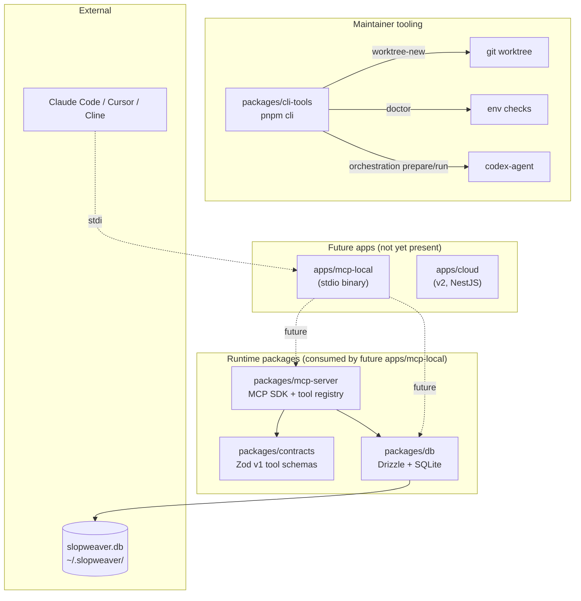
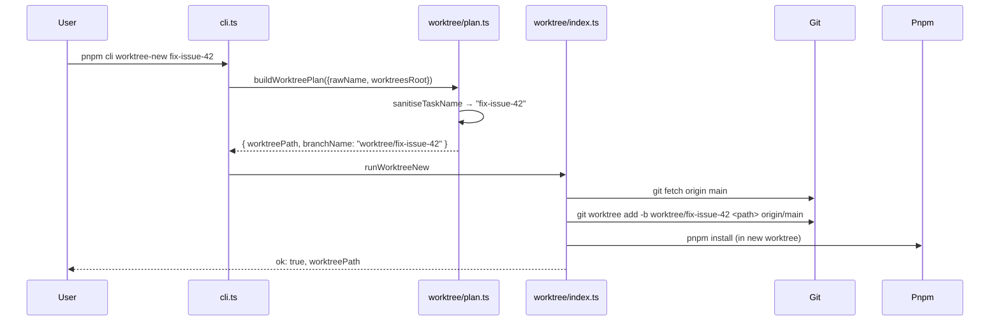
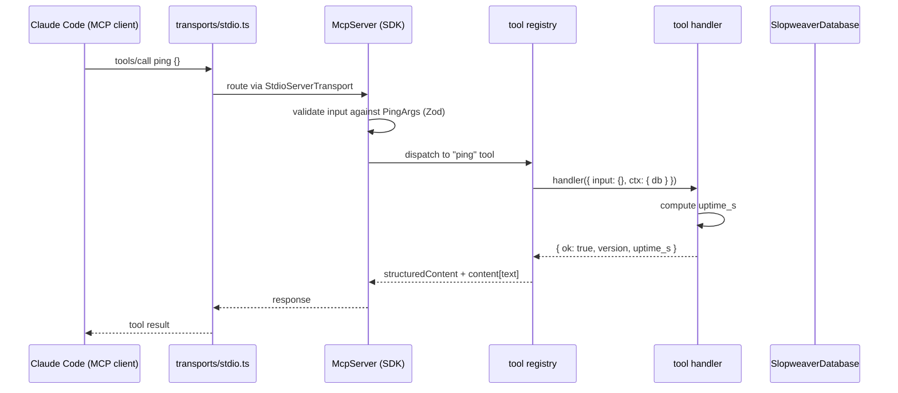
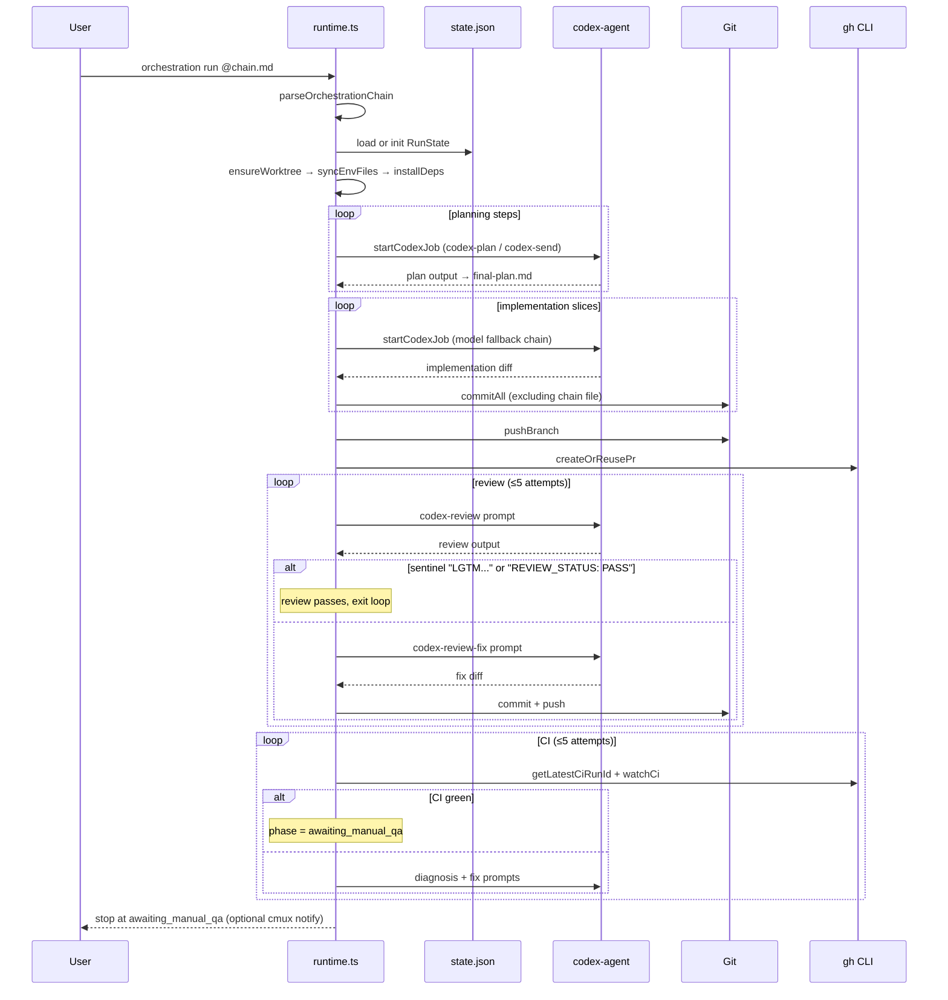

# Codebase Map

> Auto-generated by Cartographer. Last mapped: 2026-05-03T12:05:27Z
>
> SlopWeaver is an open-source local-first MCP server (pre-alpha, v1.0.0 in development) that helps Claude Code answer "what should I work on next?" by searching across your work tools.

## System Overview

The repo is a Turborepo monorepo with four packages, no apps yet, plus a maintainer CLI for worktrees and codex+claude orchestration. The eventual `apps/mcp-local/` (the published `npm install -g slopweaver` binary) is not yet present — it will compose the existing `db`, `contracts`, and `mcp-server` packages.



## Repo state

This repo is **pre-alpha**. Most of the v1.0.0 surface area named in `CLAUDE.md` (`apps/mcp-local`, `packages/integrations/`, `packages/auth/`, `packages/memory/`, `packages/web-ui/`) does not yet exist. What is present:

- 4 packages (`cli-tools`, `contracts`, `db`, `mcp-server`)
- Full repo plumbing: CI, release workflow, ESLint boundaries, Biome, knip, Turborepo, Vitest, AI workflow rules, slash commands, issue templates, PR template

## Directory Structure

```
.
├── .claude/                       Claude Code settings, slash commands, workflow rules
│   ├── commands/                  Slash commands: /codex /fix-issue /investigate /review-pr
│   ├── rules/                     workflow.md, pr-conventions.md
│   └── settings.json              Pre-allowed bash commands and plugins
├── .github/
│   ├── ISSUE_TEMPLATE/            5 templates (bug/feature/integration/decision/task) + config.yml
│   ├── workflows/                 ci.yml, release.yml (npm Trusted Publisher / OIDC)
│   ├── pull_request_template.md
│   └── FUNDING.yml
├── docs/
│   ├── contributing/ai-workflow.md
│   └── orchestration/             chain-format.md + examples/refactor-example.md
├── packages/
│   ├── cli-tools/                 Maintainer CLI: worktrees, doctor, orchestration prepare/run
│   ├── contracts/                 Zod schemas for v1 MCP tools (ping, start_session)
│   ├── db/                        Drizzle ORM + better-sqlite3 + auto-migrations
│   └── mcp-server/                Framework-agnostic MCP server + ping tool + stdio transport
├── biome.json                     Primary formatter + linter (Biome 2.4.14)
├── eslint.config.js               Structural rules only: package boundaries + @nestjs/* ban
├── knip.json                      Dead-code config
├── tsconfig.base.json             Strict + exactOptionalPropertyTypes + verbatimModuleSyntax
├── turbo.json                     Pipeline graph; .nvmrc + tsconfig.base.json invalidate cache
├── pnpm-workspace.yaml            apps/* + packages/*
├── package.json                   pnpm 10, Node 22, scripts (validate = format:check + lint + compile + test + knip)
├── README.md                      Public install instructions ("coming with v1.0.0")
├── CLAUDE.md                      Authoritative agent instructions
├── CONTRIBUTING.md                Discussion → Issue → PR; ≤500 line PR cap
├── SECURITY.md                    Coordinated disclosure (5d ack / 30d confirm / 90d fix)
├── RELEASING.md                   npm OIDC publish via release.yml + manual approval gate
└── pnpm-lock.yaml
```

## Module Guide

### `packages/cli-tools` — Maintainer CLI

**Purpose**: Internal-only developer CLI invoked as `pnpm cli ...`. Not published to npm (`"private": true`). Executes raw TypeScript via `tsx` — no build step.

**Entry point**: `packages/cli-tools/src/cli.ts` (wires `cac` to subcommand handlers)

**Key files**:

| File | Purpose |
|------|---------|
| `src/cli.ts` | Top-level cac wiring; registers `worktree-new`, `doctor`, `orchestration <subcmd>` |
| `src/doctor/index.ts` | Runs all doctor checks; handles interactive `~/.slopweaver` creation prompt |
| `src/doctor/checks.ts` | Pure check fns: Node version, pnpm version, port 60701, codex-agent health, data dir |
| `src/lib/data-dir.ts` | XDG-aware resolver for `~/.slopweaver` (or `$XDG_DATA_HOME/slopweaver`) |
| `src/lib/paths.ts` | `findMonorepoRoot()` (walks up to `pnpm-workspace.yaml`) + `resolveWorktreesRoot` |
| `src/lib/colors.ts` | Raw ANSI escape constants used by orchestration runtime only |
| `src/orchestration/core.ts` | Pure logic: chain parsing, slug derivation, prompt building, model selection |
| `src/orchestration/runtime.ts` | Stateful engine: worktree bootstrap, planning → implement → PR → review → CI loop |
| `src/orchestration/index.ts` | Adapter from cac CLI options to runtime types |
| `src/worktree/plan.ts` | Pure name sanitisation + plan construction |
| `src/worktree/index.ts` | Subprocess wiring: `git fetch` → `git worktree add` → `pnpm install` |

**Public CLI surface**:

| Command | Effect |
|---------|--------|
| `pnpm cli worktree-new <name>` | Fetches `origin/main`, creates worktree at `../worktrees/<slug>` on branch `worktree/<slug>`, runs `pnpm install` |
| `pnpm cli worktree-new <name> --no-install` | Same, skips install |
| `pnpm cli doctor` | Runs 4–5 environment checks; offers to create `~/.slopweaver` if missing |
| `pnpm cli orchestration prepare <chain>` | Bootstraps worktree + writes `launcher-manifest.json` and prompt artifact files (no codex calls) |
| `pnpm cli orchestration run <chain>` | Codex-only end-to-end: planning → implement → PR → review (≤5) → CI (≤5) → `awaiting_manual_qa` |
| `pnpm cli orchestration run <chain> --dry-run` | Prints resolved plan and exits |

**Conventions**: Named-object params throughout. Side-effectful deps (`exec`, `prompt`, `mkdir`, `log`, `now`) injectable for tests. Result-object error handling in subprocess wrappers (no thrown exceptions).

**Tests**: Co-located `*.test.ts` next to source. No tests for `cli.ts`, `orchestration/index.ts`, `orchestration/runtime.ts`, `lib/colors.ts`.

### `packages/contracts` — Zod schemas for v1 MCP tools

**Purpose**: Single source of truth for v1 MCP tool input/output shapes and shared domain types. Zero internal dependencies; only depends on `zod`.

**Entry point**: `packages/contracts/src/index.ts` (single source file)

**Exports** (named, all paired as `export const Schema` + `export type T = z.infer<typeof Schema>`):

| Export | Shape |
|--------|-------|
| `PingArgs` | `{}` (empty strict) |
| `PingResult` | `{ ok: true, version: string, uptime_s: int >= 0 }` |
| `Reference` | discriminated union on `kind`: `'url'` \| `'canonical'` |
| `Freshness` | `{ integration, last_polled_at: IsoDatetime \| null, stale }` |
| `EvidenceLogEntry` | `{ id, integration, kind, ref, occurred_at, payload_json: JsonValue, citation_url }` |
| `StartSessionArgs` | `{ integrations?, max_items? (1–25), force_refresh? }` |
| `StartSessionResult` | `{ items, evidence, freshness, generated_at }` |

**Conventions**: All schemas are `.strict()` (extra props rejected). `IsoDatetimeSchema = z.iso.datetime({ offset: true })` requires explicit timezone offset.

### `packages/db` — Drizzle ORM + SQLite

**Purpose**: SQLite-backed local store. Auto-runs migrations on `createDb()`. No internal dependencies.

**Entry point**: `packages/db/src/index.ts` exporting `createDb`.

**Schema** (4 tables, all timestamps in epoch milliseconds):

| Table (SQL) | Drizzle export | PK | Constraints |
|-------------|---------------|-----|-------------|
| `evidence_log` | `evidenceLog` | autoincrement `id` | UNIQUE `(integration, external_id)`; indexed by `(integration, kind)` and `(integration, occurred_at_ms)` |
| `identity_graph` | `identityGraph` | autoincrement `id` | UNIQUE `(integration, external_id)`; indexed by `canonical_id` |
| `integration_state` | `integrationState` | natural `integration` | tracks cursor + poll start/complete timestamps |
| `workspaces` | `workspaces` | `id = 1` (no autoinc) | CHECK `id = 1` (single-row enforced; widens when multi-workspace lands) |

**DB path resolution** (`src/path.ts`):
1. If `XDG_DATA_HOME` set → `$XDG_DATA_HOME/slopweaver/slopweaver.db`
2. Otherwise → `~/.slopweaver/slopweaver.db`

**Migrations**: Generated by `drizzle-kit generate` into `packages/db/migrations/`. Currently one migration: `0000_overconfident_lionheart.sql`. Applied automatically inside `createDb()` via Drizzle's `migrate()` call (synchronous, since better-sqlite3 is sync). The `migrationsFolder` path is resolved relative to `import.meta.url`, **not** `process.cwd()` — so it works regardless of where the consuming app runs from.

**Drizzle config**: `dialect: 'sqlite'`, `out: './migrations'`, `schema: './src/schema'`.

### `packages/mcp-server` — Framework-agnostic MCP server

**Purpose**: Reusable MCP server building block. Combines a typed tool registry with the official `@modelcontextprotocol/sdk`. Transport-agnostic — `createMcpServer` does not call `connect()`.

**Entry point**: `packages/mcp-server/src/index.ts` (re-exports public surface).

**Public exports**:

| Export | Origin | Purpose |
|--------|--------|---------|
| `createMcpServer({ db, tools, version })` | `server.ts` | Returns wired `McpServer` (no transport attached) |
| `defineTool({ name, description, inputSchema, outputSchema, handler })` | `tools/registry.ts` | Type-safe tool factory; schemas constrained to `z.ZodObject` |
| `createPingTool({ version, startedAtMs, now? })` | `tools/builtin/ping.ts` | Built-in ping tool |
| `startStdio({ server })` | `transports/stdio.ts` | Constructs `StdioServerTransport`, calls `server.connect()`, returns `{ transport }` |
| Types: `Tool`, `ToolDefinition`, `ToolHandler`, `ToolHandlerArgs`, `ToolHandlerContext`, `CreateMcpServerArgs`, `CreatePingToolArgs`, `StartStdioArgs`, `StartStdioHandle` | various | |

**Tool registry pattern**: `defineTool` is fully generic for compile-time safety, but stores type-erased `Tool` objects so `ReadonlyArray<Tool>` works without variance issues. Input validation is delegated to the MCP SDK before `handler` is called — this invariant is pinned by `server.test.ts`.

**Tool handler context**: Currently just `{ db: SlopweaverDatabase }`. Future tools will use this to query the local store.

**Built-in `ping`**: Returns `{ ok: true, version, uptime_s: floor((now - startedAtMs) / 1000) }`. Clock injectable for tests.

## Data Flow

### Worktree creation (`pnpm cli worktree-new fix-issue-42`)



### MCP request flow (target shape, once `apps/mcp-local` exists)



### `/codex` orchestration loop (`pnpm cli orchestration run <chain>`)



## Stack

| Dimension | Value |
|-----------|-------|
| Node | 22 (`.nvmrc`, `engines.node>=22.0.0`) |
| Package manager | pnpm 10 (`packageManager: pnpm@10.0.0`) |
| Monorepo | Turborepo 2.9.7, workspaces `apps/*` + `packages/*` |
| Language | TypeScript 6.0.3, strict + `exactOptionalPropertyTypes` + `noUncheckedIndexedAccess` + `verbatimModuleSyntax`; ES2022 / NodeNext |
| Formatter + primary linter | Biome 2.4.14 |
| Structural lint | ESLint 10.3.0 + `eslint-plugin-boundaries` (boundaries + `@nestjs/*` ban only) |
| Dead code | Knip 6.7.0 |
| Tests | Vitest 4.1.5 (Polly planned for HTTP recording in integration tests) |
| DB | better-sqlite3 12.2.0 + drizzle-orm 0.45.2 (drizzle-kit 0.31.10 dev) |
| MCP | `@modelcontextprotocol/sdk@1.29.0` |
| Validation | Zod 4.4.2 (uses Zod 4 APIs: `z.url()`, `z.iso.datetime`) |
| CLI | `cac@7.0.0`, `@inquirer/prompts@8.4.2`, `picocolors@1.1.1`, `tsx@4.21.0` |

## CI gates

`.github/workflows/ci.yml` runs on every PR and push to `main` (Ubuntu, single Node version from `.nvmrc`, 15-min timeout):

1. `pnpm install --frozen-lockfile`
2. `pnpm format:check`
3. `pnpm lint`
4. `pnpm knip`
5. `pnpm compile`
6. `pnpm test`

The local `pnpm validate` script (root `package.json`) bundles all five quality gates: `format:check && lint && compile && test && knip`. The release workflow's `verify` job omits `knip`.

All GitHub Action versions are pinned by full commit SHA (supply chain hardening). The release `publish` job uses `--ignore-scripts` on install to block transitive postinstall from minting OIDC tokens.

## Conventions

### Workflow

- **Always work in a worktree** under `<repo-parent>/worktrees/<slug>` on branch `worktree/<slug>`. Main checkout is read-only.
- **One worktree = one branch = one PR.** Squash-merge only.
- **Catch up via merge, never rebase**: `git fetch origin main && git merge origin/main`.
- **Run all 5 CI gates locally** before opening a PR.

### PRs

- **Title**: conventional-commits style: `<type>(<scope>): <imperative summary>`. Types: `feat`, `fix`, `docs`, `chore`, `ci`, `refactor`, `test`, `perf`. Common scopes: `cli-tools`, `mcp-server`, `web-ui`, `db`, `auth`, `integrations`.
- **Body**: use `.github/pull_request_template.md`. Always include `closes #N` or `refs #N`.
- **Size**: ≤500 lines of diff (excluding lockfiles, migrations, snapshots). New package skeletons are exempt.
- **Scope**: one concern per PR. File a separate issue for unrelated drive-by fixes.

### Code style

- **No `any`** in production code. **Named object params** for any function with 1+ args.
- **`import type`** required for type-only imports (verbatimModuleSyntax).
- **Strict + exactOptionalPropertyTypes**: `undefined` is not assignable to `T?` — must be `T | undefined`.
- **Comments**: only for non-obvious WHY. CodeRabbit's docstring gate is disabled deliberately.
- **Package boundaries** (ESLint): `apps/*` may import `packages/*`; `packages/*` may import `packages/*`; packages **never** import apps.
- **`@nestjs/*` is banned in `packages/*`** — reserved for future `apps/cloud/`.

### Decisions

- Significant tradeoffs filed as `decision-record` GitHub Issues, not private docs.
- Strategy / cloud-tier internals live in a separate private repo (`slopweaver-private`).

## Gotchas

- **`packages/db` migrations folder is resolved relative to `import.meta.url`** in `src/index.ts`, not `process.cwd()`. Apps importing `createDb()` from any directory get the correct migrations path.
- **`packages/db` workspaces table CHECK constraint** (`id = 1`) is intentionally temporary for v1. When multi-workspace lands, drop it and widen the uniqueness constraints in `evidence_log`/`identity_graph`.
- **Zod 4 in contracts**: uses `z.url()` and `z.iso.datetime({ offset: true })`. Mixing Zod 3 schemas across packages would break.
- **Tool registry type erasure**: `defineTool` erases generics so `ReadonlyArray<Tool>` works. The MCP SDK is responsible for input validation before the handler runs — `server.test.ts` pins this invariant.
- **Worktree branch resolution**: `findMonorepoRoot()` in `cli-tools/src/lib/paths.ts` walks up from `import.meta.url`, so when invoked inside a worktree it resolves the *worktree's* repo root, not the main checkout's.
- **`xdgDataHome: ''`** (empty string) is treated as unset — falls back to `~/.slopweaver`. Same for `home: ''`.
- **`pnpm validate` includes `knip`, but the release workflow's `verify` job does not.** CI does run knip.
- **`pnpm build` and `pnpm validate` and `pnpm knip` are NOT in `.claude/settings.json` allowlist** — agents must request permission to run them.
- **`--executor hybrid` on `pnpm cli orchestration run` is silently overridden to `codex-only`**. The hybrid path runs through an external Claude-side launcher consuming `launcher-manifest.json`, not through `run`.
- **Codex review pass is matched by exact-string sentinels**: `LGTM - ready for local testing.` or `REVIEW_STATUS: PASS`.
- **`MAX_REVIEW_ATTEMPTS = 5` and `MAX_CI_ATTEMPTS = 5`** in `runtime.ts` — runs that exceed these abort.
- **`pre-1.0` builds are unsupported** per `SECURITY.md` — do not run in production.
- **All GitHub Action versions are pinned by full SHA**; bumping requires updating both the SHA and the `# v.X.Y` comment.
- **`*.har` is git-ignored** to prevent accidentally committing Polly cassettes with real auth headers. Verify any added test fixture.
- **The repo is public.** Never commit API keys, OAuth secrets, real customer/employer names, or HAR files.

## Navigation Guide

**To add a new MCP tool** (e.g. a future `start_session`):
1. Add input/output Zod schemas to `packages/contracts/src/index.ts` (already done for `start_session`)
2. Add tests in `packages/contracts/src/index.test.ts`
3. Create `packages/mcp-server/src/tools/builtin/<name>.ts` using `defineTool`, importing schemas from `@slopweaver/contracts`
4. Re-export the factory from `packages/mcp-server/src/index.ts`
5. Add a server-level integration test in `packages/mcp-server/src/server.test.ts`
6. (When `apps/mcp-local` exists) wire the new tool into the `tools` array passed to `createMcpServer`

**To add or change a database table**:
1. Edit a file in `packages/db/src/schema/` (or add a new one and re-export from `schema/index.ts`)
2. Run `pnpm --filter @slopweaver/db drizzle-kit generate` from a clean main baseline (per repo convention — never hand-write migrations)
3. Update `packages/db/src/db.test.ts` to exercise new constraints
4. Update tables list in this map

**To add a new doctor check**:
1. Add a pure check function to `packages/cli-tools/src/doctor/checks.ts` with named-object params and an injectable side-effectful dep
2. Add unit tests in `packages/cli-tools/src/doctor/checks.test.ts` using inline fakes
3. Wire it into the run order in `packages/cli-tools/src/doctor/index.ts`
4. If the check is auto-fixable, extend the `Fixable` union and handle the new case in `runDoctor`

**To add a new CLI subcommand**:
1. Create `packages/cli-tools/src/<feature>/index.ts` exporting an injectable `run<Feature>(args)` function (named params, optional deps for tests)
2. Add tests under the same directory
3. Register the command in `packages/cli-tools/src/cli.ts` with `cac`
4. Update `packages/cli-tools/README.md`

**To add a new orchestration phase or chain step role**:
1. Extend `OrchestrationRole` / `OrchestrationPhase` in `packages/cli-tools/src/orchestration/core.ts`
2. Update `STEP_HEADING_REGEX` if needed
3. Add prompt-builder function (model: `build<Phase>Prompt`) and unit tests in `core.test.ts`
4. Wire the new phase into `advancePhase` and the run loop in `runtime.ts`
5. Update `docs/orchestration/chain-format.md`

**To change CI gates**:
1. Edit `.github/workflows/ci.yml` (steps + pinned action SHAs)
2. Mirror the change in `release.yml`'s `verify` job if the new gate is release-relevant
3. Update root `package.json` `validate` script if it should be part of `pnpm validate`
4. Update the "CI gates" section in this map

**To trace what `pnpm cli` invokes**:
- Root `package.json` script `cli` → `tsx packages/cli-tools/src/cli.ts`
- That file routes to `./worktree/index.ts`, `./doctor/index.ts`, or `./orchestration/index.ts` via `cac`

**To understand chain file format**:
- Schema: `docs/orchestration/chain-format.md`
- Worked example: `docs/orchestration/examples/refactor-example.md`
- Parser: `packages/cli-tools/src/orchestration/core.ts` (`parseOrchestrationChain`, `STEP_HEADING_REGEX`)
